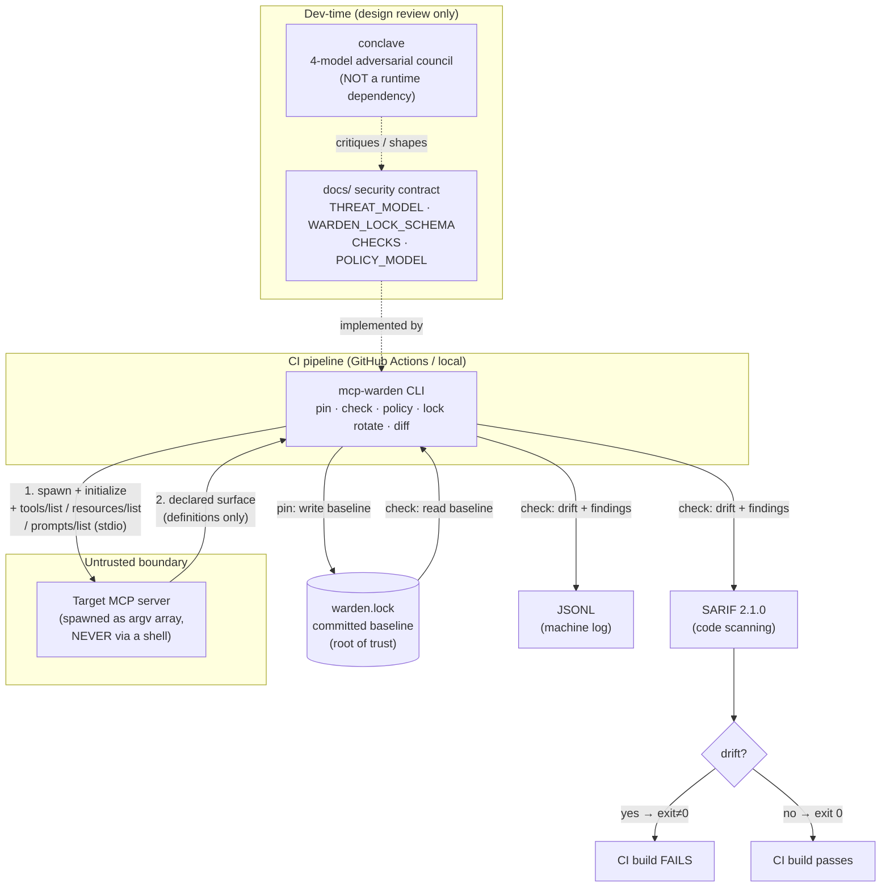
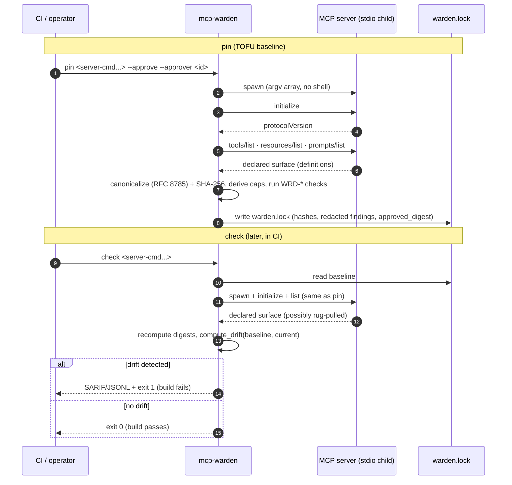
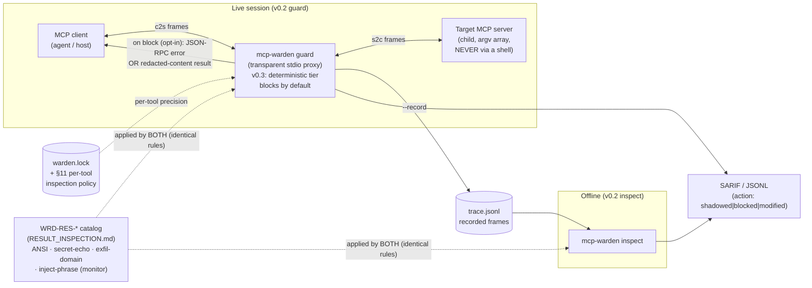

# mcp-warden — System Context Diagram

Where mcp-warden sits, what it talks to, and where its outputs go. The **v0.1** path
(`pin`/`check`/`policy`) is a **read-only, definition-only** gate: it spawns the target
MCP server over stdio, captures the *declared* surface, and writes a baseline + machine
reports — no proxy, no runtime interception. The **v0.2** path added a transparent stdio
**proxy** (`guard`) and an **offline analyzer** (`inspect`) that inspect tool *results*
at runtime; see C3 below. **v0.3** promotes the deterministic tier to **block by default**
(opt-OUT per category via `--no-block-<category>`; `--audit-only` restores full shadow) and
hardens the proxy lifecycle (cancel/progress passthrough, server-crash + client-disconnect
teardown, reserved transport code `-32002`); see `docs/GUARD_PROXY_V3.md`. **v0.3** also adds
`lock rotate` — a lifecycle verb that re-attests an existing baseline's structured provenance
(`pinner`/`attestations`) **without re-capturing the surface**, leaving `overall_digest`
byte-identical and failing closed on a tampered lock (`docs/WARDEN_LOCK_SCHEMA.md` §8.1–§8.2).
**v0.3** further adds `diff <lock-a> <lock-b>` — an **offline, redacted viewer** that renders
integrity drift between two EXISTING locks by reusing `compute_drift` (no capture, no new diff
logic) plus a separate informational provenance section. It never prints raw
`server.command`/`args` (secret-safe); default exit 0, `--exit-code` → 1 on integrity drift only.

> `conclave` (the 4-model adversarial council referenced in `docs/THREAT_MODEL.md`)
> is a **dev-time design reviewer** that shaped this contract. It is **NOT** a
> runtime dependency and is never invoked by `pin`/`check`/`policy`.

> **`action.yml` (Issue #18)** is the primary consumer delivery vehicle for the `check`
> gate. Consumers pin `ernestprovo23/mcp-warden@<tag>` in their workflow; the composite
> action wraps the C2 sequence (steps 1–5 of the pin/check sequence above) behind a
> single `uses:` step with hash-locked supply-chain, injection guard, SARIF upload, and
> cross-OS support. See `action/requirements.lock` and `README.md` §GitHub Action.

> **`.pre-commit-hooks.yaml` (Issue #22)** is the **local pre-CI gate** delivery vehicle.
> The `mcp-warden-precommit` wrapper runs the SAME `check` verdict via `check_core.run_check`
> (read_lock→capture→build_lock(in-memory)→compute_drift) so a local hook and CI can never
> disagree on drift. It is check-only: it never pins, never writes `warden.lock`. Drift always
> exits 1 in both modes; a *locally* unspawnable server is non-blocking by default (exit 0 +
> warning) and fail-closed under `--strict` (exit 2) — CI stays strict. The wrapper normalizes
> cwd to the git repo root before capturing. See `README.md` §pre-commit hook.

---

## C1 — System context

---

## C2 — `pin` then `check` sequence

> `compute_drift` structurally classifies tool `inputSchema` changes via the normalized
> `schema_skeleton` stored in the lock (`schema_version` 2): each security-relevant mutation
> is a per-fact `WRD-DRIFT-SCHEMA-*` item (`docs/WARDEN_LOCK_SCHEMA.md` §6.2). v1 locks fall
> back to a single high-severity `schema-modified` until re-pinned.

---

## C3 — `guard` runtime proxy + `inspect` offline analyzer (v0.2)

- `guard` passes **every frame through untouched EXCEPT** `tools/call` request/response
  (+ the `tools/list_changed` gate vs the lock). `initialize`/capabilities are never
  rewritten; enforcement begins only at the first `tools/call` (`GUARD_PROXY.md` §2).
- A framing/inspection **error fails open** — the frame passes through and the session is
  never killed (`GUARD_PROXY.md` §9). Oversized frames (> `--max-frame-bytes`) and truncated
  frames at EOF also fail open (`GUARD_PROXY_V3.md` §2.3–§2.4).
- "Block" on the wire is a **well-formed JSON-RPC frame**: an error response (`-32001`) for
  blocked requests/exfil/secret-echo results, or a redacted-content result for ANSI stripping
  (`GUARD_PROXY.md` §7).
- **v0.3 lifecycle:** `notifications/cancelled` + `notifications/progress` pass through
  untouched even mid-`tools/call`; a server crash mid-call synthesizes a `-32002` transport
  error for every pending id (client never hangs); a client disconnect reaps the child via its
  process group (no orphan) (`GUARD_PROXY_V3.md` §1–§2).

---

## Trust boundary (from `docs/THREAT_MODEL.md` §3.3)

- **Trusted:** mcp-warden, the Python runtime it runs in, and `warden.lock` in
  the repo (delegated to host controls — PR review, branch protection).
- **Untrusted:** everything on the server side of the stdio pipe.
- The boundary is the **stdio channel** between mcp-warden and the spawned server.

## What is explicitly NOT in this picture

**v0.1 (`pin`/`check`/`policy`):**
- No runtime proxy / no agent-in-the-loop (`policy` is design-time only).
- No tool-result inspection (the headline gap, `T-RESULT` — addressed by v0.2 `guard`).

**Still NOT in scope, even with v0.2 `guard`/`inspect`:**
- No behavioral defense (`T-BEHAVE`) — content is inspected, side effects are not.
- No cross-call/conversational correlation; each frame is inspected independently.
- No decoding of image/audio/blob/base64 result content (coverage gap recorded as
  `WRD-RES-UNINSPECTABLE`).
- No network calls / no DNS resolution by checks, policy, or the proxy — exfil + SSRF
  match on literal host strings only.
- stdio transport only (HTTP/SSE deferred for all of v0.1/v0.2/v0.3).
- The fuzzy `WRD-RES-INJECT-PHRASE` MONITOR tier is **never default-block**, even in v0.3
  (opt-in only via `--block-inject-phrase`).
- Windows lifecycle guarantees are **experimental** in v0.3 — job-object best-effort teardown,
  no orphan-freedom claim (the `-32002` pending-id synthesis still runs); see
  `docs/GUARD_PROXY_V3.md` §3.
